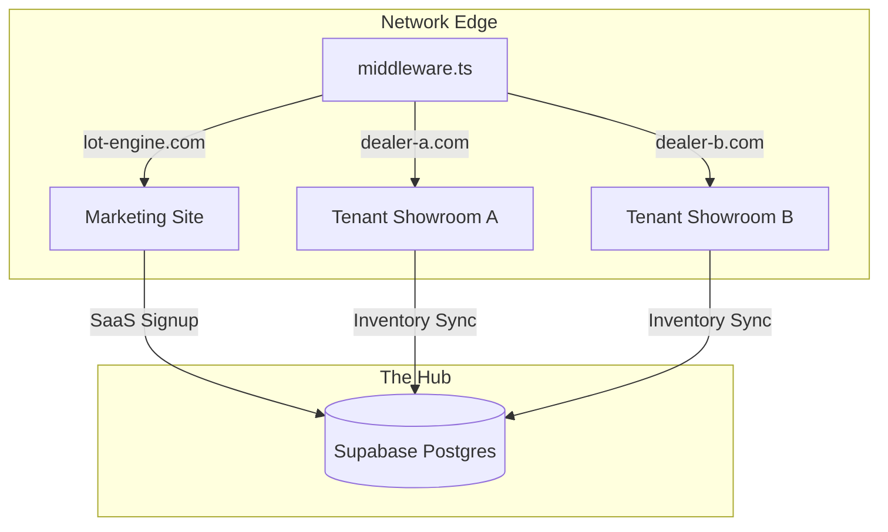
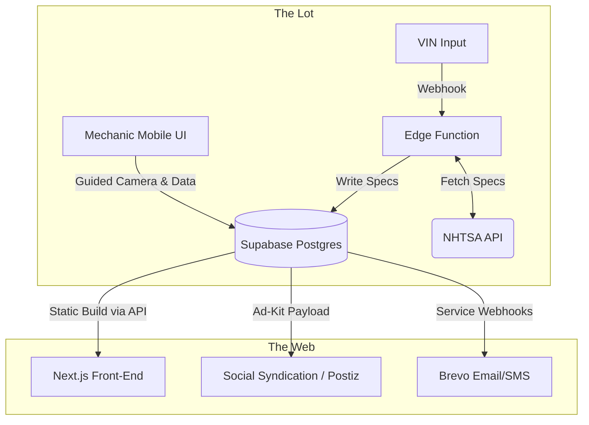

# ⚙️ LotEngine

LotEngine is a lightweight, headless operating system built for independent automotive dealerships. It abstracts away the bloat and "luxury tax" of legacy dealership software, providing a unified and extensible platform for inventory management, marketing automation, and dealership operations.

It is designed to act as a 1:1 digital twin of the physical asphalt.

## 🏗️ System Architecture

The platform utilizes a **true multi-tenant architecture** with domain-based routing, serving both the global SaaS marketing site and individual dealer showrooms from a single optimized instance.



### The Lot Pipeline (Digital Twin)



## 🛠️ The Tech Stack

- **Frontend**: Next.js 16 (App Router), React 19, Tailwind CSS 4
- **Animations**: Framer Motion (Industrial-grade UI)
- **Database & Auth**: Supabase (PostgreSQL + Row-Level Security)
- **Email Protocol**: Resend (Server-side notifications)
- **Infrastructure**: Vercel (Edge) with `middleware.ts` domain routing

## 🔒 Security Model

LotEngine uses a defense-in-depth approach with two complementary layers:

1. **Server-Side Auth Guard** — The admin layout validates the user session via `@supabase/ssr` on the server *before* rendering any protected UI. No client-side-only auth.
2. **Row-Level Security (RLS)** — All database tables enforce tenant isolation through a `user_tenant_roles` junction table. A user can only read or write rows belonging to a tenant they are explicitly assigned to. Cross-tenant data leakage is structurally impossible at the DB layer.

## 🚀 Core Mechanisms

- **Dynamic Multi-Tenancy**: Zero-configuration domain mapping with robust lookup fallbacks for Vercel preview environments.
- **`getLink()` Utility**: All internal navigation uses a shared `lib/getLink.ts` utility to build domain-aware paths. Never hardcoded strings.
- **Hybrid Login Gate**: Failsafe authentication pipeline supporting both high-speed Access Keys (Passwords) and asphalt-ready Secure Links (Magic Link OTP).
- **Rugged Professionalism Aesthetic**: A high-contrast, flat design system optimized for maximum sunlight readability and industrial performance. (No shadows, sharp 90° corners, pure white/black).
- **Service Kanban Engine**: An industrial-grade 5-stage workflow for managing repairs on the lot (Intake → Diagnostics → Awaiting Parts → In Progress → Ready).
- **Inventory Terminal**: A deep-dive management hub for asset capture, VIN decoding, and multi-tenant repository management.
- **Smart Sync**: Built-in support for offline-first data entry with persistent "SAVED" states.
- **Offline Photo Engine**: A mobile-first, guided capture terminal that safely queues heavy image payloads in an IndexedDB cache when deep in the lot, automatically syncing to the cloud when connectivity returns. Failed uploads are retained and retried — no silent data loss.
- **Dynamic Tenant Branding**: The entire UI seamlessly shifts its industrial tactical aesthetic to match the exact primary brand hex code assigned to the tenant.

## 📱 Mobile-First Operations

LotEngine is designed to be used while walking the asphalt. Every admin interface is optimized for thumb-friendly interaction and tablet hybrid layouts.
- **Admin Layout**: Responsive sidebar that collapses into a bottom navigation bar on phones.
- **Always-Visible Actions**: Tactical hardware-style buttons for high-performance touch interaction.
- **Service Terminal**: Full-screen "native app" experience for mechanics on the shop floor.

## 💻 Local Development Setup

To run LotEngine locally, you need Node.js and a Supabase project.

### Clone the repository:

```bash
git clone https://github.com/benwiththelens/LotEngine.git
cd lotengine
```

### Install dependencies:

```bash
npm install
```

### Configure Environment Variables:

Create a `.env.local` file in the root directory:

```env
NEXT_PUBLIC_SUPABASE_URL="your-supabase-url"
NEXT_PUBLIC_SUPABASE_PUBLISHABLE_KEY="your-publishable-key"
NEXT_PUBLIC_VIN_API_URL="https://vpic.nhtsa.dot.gov/api/vehicles/DecodeVin/"
RESEND_API_KEY="re_your_key"
```

> **Note:** LotEngine uses `NEXT_PUBLIC_SUPABASE_PUBLISHABLE_KEY`, not the legacy `ANON_KEY`. Verify the key name in your Supabase project's API settings.

### Start the development server:

```bash
npm run dev
```

The application will be available at http://localhost:3000.

## 👥 Tenant Management & Seeding

Since LotEngine is multi-tenant, you can manage client configurations directly via SQL. Here are the common database seeding and migration patterns.

### 1. Seeding a Dummy Local Tenant
To map a local testing instance to a clean dummy tenant (e.g., Apex Motors) and prevent loading live client data, run this in your Supabase SQL Editor:

```sql
INSERT INTO tenants (id, domain, business_name, color_primary, color_background)
VALUES (
  'd4a4d6f8-4b77-4b10-9b43-9876543210ab', -- Tenant UUID
  'localhost:3000',                       -- Local mapping
  'Apex Motors',
  '#0055FF',                              -- Brand primary color
  '#FFFFFF'
)
ON CONFLICT (domain) DO UPDATE 
SET business_name = 'Apex Motors', color_primary = '#0055FF';
```

### 2. Assigning a User to a Tenant
After seeding a tenant, assign your Supabase user account to it so RLS policies grant access:

```sql
INSERT INTO user_tenant_roles (user_id, tenant_id, role)
VALUES (
  'your-supabase-user-uuid',
  'your-tenant-uuid',
  'admin'
)
ON CONFLICT (user_id, tenant_id) DO NOTHING;
```

### 3. Migrating All Mock Assets to a New Tenant
If you have created vehicles or service tickets under another tenant and want to transfer them to your local dummy tenant:

```sql
DO $$
DECLARE
  target_tenant_id UUID := 'd4a4d6f8-4b77-4b10-9b43-9876543210ab'; -- Apex Motors
BEGIN
  -- Migrate vehicles
  UPDATE vehicles SET tenant_id = target_tenant_id WHERE tenant_id != target_tenant_id;
  
  -- Migrate service orders
  UPDATE service_orders SET tenant_id = target_tenant_id WHERE tenant_id != target_tenant_id;
  
  -- Migrate leads
  UPDATE leads SET tenant_id = target_tenant_id WHERE tenant_id != target_tenant_id;
END $$;
```

### 4. Setting Client Address, Phone, & Hours
Dealer contact details are loaded dynamically from the `tenants` table. To set a client's real details in the database:

```sql
UPDATE tenants
SET 
  address = '505 US-77' || chr(10) || 'Cortland, NE 68331', -- Uses SQL newline character
  phone = '(402) 798-7373',
  hours = '[
    {"day": "Monday", "time": "8:30 – 5:00"},
    {"day": "Tuesday", "time": "8:30 – 5:00"},
    {"day": "Wednesday", "time": "8:30 – 5:00"},
    {"day": "Thursday", "time": "CLOSED", "isClosed": true},
    {"day": "Friday", "time": "8:30 – 5:00"},
    {"day": "Saturday", "time": "8:30 – 12:00"},
    {"day": "Sunday", "time": "CLOSED", "isClosed": true}
  ]'::jsonb,
  reviews = '[
    {"name": "John Rockenbach", "text": "Absolutely love this team! They''ve kept us in reliable vehicles for over 25 years!", "rating": 5},
    {"name": "Loree Leon", "text": "Very pleased with the service and knowledge. Happy with my ride and would refer anyone.", "rating": 5},
    {"name": "Donna Splichal", "text": "A wonderful place to buy a car. They treat you like family.", "rating": 5}
  ]'::jsonb
WHERE domain = 'localhost:3000'; -- Swap with the client's production domain when ready
```

Built for speed, clarity, and zero friction.
