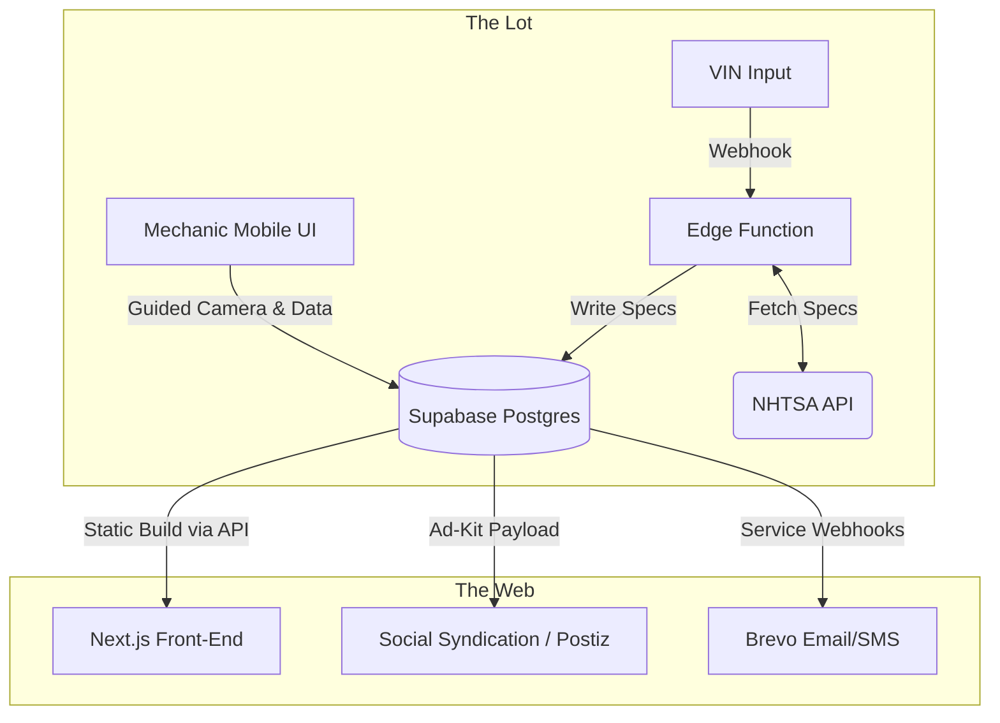

# ⚙️ LotEngine

LotEngine is a lightweight, headless operating system built for independent automotive dealerships. It abstracts away the bloat and "luxury tax" of legacy dealership software, providing a unified and extensible platform for inventory management, marketing automation, and dealership operations.

It is designed to act as a 1:1 digital twin of the physical asphalt.

## 🏗️ System Architecture

The platform utilizes a **true multi-tenant architecture** with domain-based routing, serving both the global SaaS marketing site and individual dealer showrooms from a single optimized instance.


### The Lot Pipeline (Digital Twin)



## 🛠️ The Tech Stack

- **Frontend**: Next.js 16 (App Router), React 19, Tailwind CSS 4
- **Animations**: Framer Motion (Industrial-grade UI)
- **Database & Auth**: Supabase (PostgreSQL)
- **Email Protocol**: Resend (Server-side notifications)
- **Infrastructure**: Vercel (Edge) with dynamic Proxy routing

## 🚀 Core Mechanisms

- **Dynamic Multi-Tenancy**: Zero-configuration domain mapping with robust lookup fallbacks for Vercel preview environments.
- **Hybrid Login Gate**: Failsafe authentication pipeline supporting both high-speed Access Keys (Passwords) and asphalt-ready Secure Links (Magic Link OTP).
- **Rugged Professionalism Aesthetic**: A high-contrast, flat design system optimized for maximum sunlight readability and industrial performance. (No shadows, sharp 90° corners, pure white/black).
- **Service Kanban Engine**: An industrial-grade 5-stage workflow for managing repairs on the lot (Intake → Diagnostics → Awaiting Parts → In Progress → Ready).
- **Inventory Terminal**: A deep-dive management hub for asset capture, VIN decoding, and multi-tenant repository management.
- **Smart Sync**: Built-in support for offline-first data entry with persistent "SAVED" states.
- **Offline Photo Engine**: A mobile-first, guided capture terminal that safely queues heavy image payloads in an IndexedDB cache when deep in the lot, automatically syncing to the cloud when connectivity returns.
- **Dynamic Tenant Branding**: The entire UI seamlessly shifts its industrial tactical aesthetic to match the exact primary brand hex code assigned to the tenant.

## 📱 Mobile-First Operations

LotEngine is designed to be used while walking the asphalt. Every admin interface is optimized for thumb-friendly interaction and tablet hybrid layouts.
- **Admin Layout**: Responsive sidebar that collapses into a bottom navigation bar on phones.
- **Always-Visible Actions**: Tactical hardware-style buttons for high-performance touch interaction.
- **Service Terminal**: Full-screen "native app" experience for mechanics on the shop floor.

## 💻 Local Development Setup

To run LotEngine locally, you need Node.js and a Supabase project.

### Clone the repository:

```bash
git clone https://github.com/benwiththelens/LotEngine.git
cd lotengine
```

### Install dependencies:

```bash
npm install
```

### Configure Environment Variables:

Create a `.env.local` file in the root directory:

```env
NEXT_PUBLIC_SUPABASE_URL="your-supabase-url"
NEXT_PUBLIC_SUPABASE_ANON_KEY="your-anon-key"
NEXT_PUBLIC_VIN_API_URL="https://vpic.nhtsa.dot.gov/api/vehicles/DecodeVin/"
RESEND_API_KEY="re_your_key"
```

### Start the development server:

```bash
npm run dev
```

The application will be available at http://localhost:3000.

Built for speed, clarity, and zero friction.
