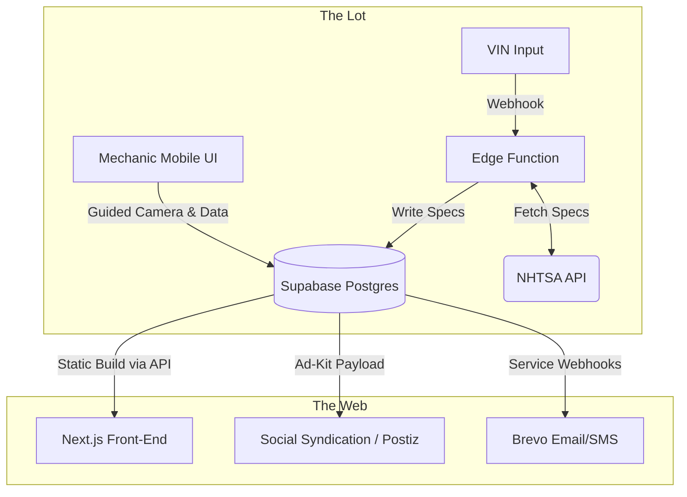

# ⚙️ LotEngine

LotEngine is a lightweight, headless operating system built for independent automotive dealerships. It abstracts away the bloat and "luxury tax" of legacy dealership software, providing a unified and extensible platform for inventory management, marketing automation, and dealership operations.

It is designed to act as a 1:1 digital twin of the physical asphalt.

## 🏗️ System Architecture

The platform utilizes a decoupled, headless architecture to maximize mobile performance on the lot and ensure absolute data portability.



## 🛠️ The Tech Stack

- **Frontend**: Next.js (App Router), React, Tailwind CSS
- **Database & Auth**: Supabase (PostgreSQL)
- **Hosting (Phase 1)**: Vercel (Edge) + Supabase Cloud
- **Hosting (Phase 2)**: Self-hosted Docker / Traefik on bare metal

## 🚀 Core Mechanisms

## 💻 Local Development Setup

To run LotEngine locally, you need Node.js and a Supabase project.

### Clone the repository:

```bash
git clone https://github.com/benwiththelens/LotEngine.git
cd lotengine
```

### Install dependencies:

```bash
npm install
```

### Configure Environment Variables:

Create a `.env.local` file in the root directory:

```env
NEXT_PUBLIC_SUPABASE_URL="your-supabase-url"
NEXT_PUBLIC_SUPABASE_ANON_KEY="your-anon-key"
NEXT_PUBLIC_VIN_API_URL="https://vpic.nhtsa.dot.gov/api/vehicles/DecodeVin/"
```

### Start the development server:

```bash
npm run dev
```

The application will be available at http://localhost:3000.

Built for speed, clarity, and zero friction.